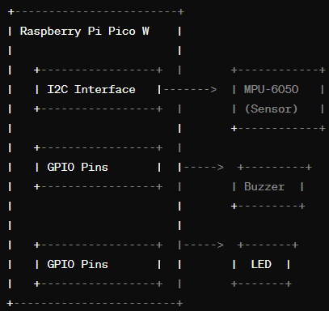
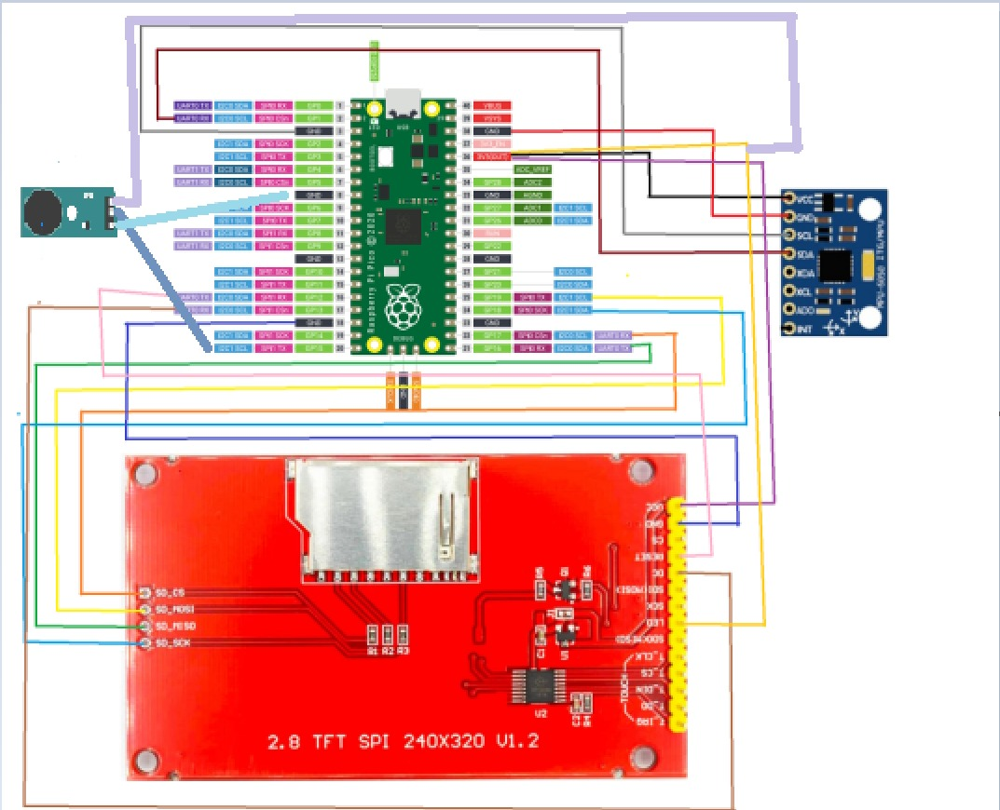

# GyroLED

| | |
|-|-|
|`Author` | Costea Vlad Stefan

## Description
This project aims to develop a system where an LED changes its behavior based on the readings from a gyroscope. Utilizing a PI PICO W, along with an MPU6050 Gyroscope and Accelerometer module, and an LED, the project showcases real-time interaction between motion-sensing technology and visual feedback.
## Motivation
The motivation behind this project is to explore the capabilities of motion sensors in real-world applications and to demonstrate the potential of integrating such sensors with microcontroller platforms for educational and developmental purposes.
## Architecture

### Block diagram

<!-- Make sure the path to the picture is correct -->

### Schematic

### Components

<!-- This is just an example, fill in with your actual components -->

| Device | Usage | Price |
|--------|--------|-------|
| Raspberry Pi Pico W | Microcontroller | [69 RON]([https://www.optimusdigital.ro/ro/audio-buzzere/635-buzzer-activ-de-3-v.html?search_query=buzzer&results=61](https://www.emag.ro/placa-dezvoltare-sparkfun-raspberry-pi-pico-w-00004995/pd/DPX22WMBM/?ref=history-shopping_361111067_12161_1)) |
| MPU6050 Module | Gyroscope & Accelerometer | [19 RON]([https://www.optimusdigital.ro/ro/butoane-i-comutatoare/1119-buton-6x6x6.html?search_query=buton&results=222](https://www.emag.ro/modul-accelerometru-si-giroscop-mpu6050-cl176/pd/DB606JBBM/?ref=history-shopping_361111067_38837_1)) |
| 2.8 inch TFT LCD Display | Display Output | [58 RON]([https://www.optimusdigital.ro/ro/fire-fire-mufate/884-set-fire-tata-tata-40p-10-cm.html?search_query=set+fire&results=110](https://www.emag.ro/afisaj-tactil-tft-lcd-240x320px-cu-cititor-sd-spi-2-8-inci-tft-28-ili9341-restouch-spi/pd/D8TNW6MBM/?ref=history-shopping_361111067_145639_1)) |

### Libraries

<!-- This is just an example, fill in the table with your actual components -->

| Library | Description | Usage |
|---------|-------------|-------|
| [Pico-SDK]([link-to-lib](https://github.com/raspberrypi/pico-sdk)) | Official SDK for Raspberry Pi Pico | Used for basic microcontroller operations  |
| [Adafruit_MPU6050]([[link-to-lib](https://github.com/tockn/MPU6050_tockn)]) | Arduino library for easy communication with MPU6050 | Used to interface with the MPU6050 sensor  |
| [Adafruit_GFX]([[link-to-lib](https://github.com/adafruit/Adafruit-GFX-Library)]) | Base library for Adafruit displays | Provides essential graphics functions for TFT display  |
| [Adafruit_ILI9341]([[link-to-lib](https://github.com/adafruit/Adafruit_ILI9341)]) | Display driver for ILI9341 chipset | Used to control the TFT LCD display  |
| [Wire]([[link-to-lib](https://github.com/adafruit/Adafruit_ILI9341)]) | I2C Communication Library | Provides functions to communicate with I2C/TWI devices  |
| [Adafruit_Sensor]([[link-to-lib](https://github.com/adafruit/Adafruit_ILI9341)]) | Unified Sensor Driver | Provides a unified interface for various sensors  |

## Log

<!-- write every week your progress here -->

### Week 6 - 12 May

### Week 7 - 19 May

### Week 20 - 26 May

## Reference links

<!-- Fill in with appropriate links and link titles -->

[Tutorial 1](https://www.youtube.com/watch?v=wdgULBpRoXk&t=1s&ab_channel=BenEater)

[Article 1](https://www.explainthatstuff.com/induction-motors.html)

[Link title](https://projecthub.arduino.cc/)
